# 1.环境准备
```
前端：购买的INSPINIA完整版
django==2.2.3
python==3.6.3
pymysql==0.9.3
djangorestframework==3.10.0
redis
pip3 install celery
pip3 install django-celery-beat
pip3 install django-celery-results
```
```
1.把本地代码上传到linux上
https://blog.51cto.com/10983441/2380368
最后一条1.11配置，本地代码上传到linux上

2.linux系统
python安装
cd /opt
wget https://www.python.org/ftp/python/3.6.3/Python-3.6.3.tar.xz
tar xf Python-3.6.3.tar.xz
cd /opt/Python-3.6.3/
./configure
yum install gcc-c++ gcc -y  #安装编译所需依赖
make  && make install

3.配置环境变量
cat /etc/profile
export PATH=$PATH:/usr/local/python3/bin/
生效
source /etc/profile

接下来就可以验证
[root@m01 opt]# python3
Python 3.6.3 (default, Jul 15 2019, 09:46:16) 
[GCC 4.4.7 20120313 (Red Hat 4.4.7-23)] on linux
Type "help", "copyright", "credits" or "license" for more information.
>>> 
[root@m01 opt]# pip3

Usage:   
  pip <command> [options]
  
  
4.连接mysql报错信息处理方法
 raise ImproperlyConfigured('mysqlclient 1.3.13 or newer is required; you have %s.' % Database.__version__)
django.core.exceptions.ImproperlyConfigured: mysqlclient 1.3.13 or newer is required; you have 0.9.3.
解决方法
注释掉下面内容
#if version < (1, 3, 13):
#    raise ImproperlyConfigured('mysqlclient 1.3.13 or newer is required; you have %s.' % Database.__version__)


File "/usr/local/python3/lib/python3.6/site-packages/django/db/backends/mysql/operations.py", line 146, in last_executed_query
    query = query.decode(errors='replace')
AttributeError: 'str' object has no attribute 'decode'
解决方法：
把decode改为encode()
query = query.encode(errors='replace')

5.生成数据，在Linux上操作，windows上操作会报错
[root@m01 CMDB]# pwd
/project/CMDB
[root@m01 CMDB]# python3 manage.py makemigrations
[root@m01 CMDB]# python3 manage.py migrate

```

# 2.功能解析
## 2.1自定义用户认证
```
参考https://docs.djangoproject.com/zh-hans/2.1/topics/auth/customizing/
由于我后来为用户添加了头像字段，所以稍有更改，可以查看项目代码

models.py
from django.db import models

# Create your models here.
from django.db import models
from django.contrib.auth.models import (
    BaseUserManager, AbstractBaseUser
)


class MyUserManager(BaseUserManager):
    def create_user(self, email, name, password=None):
        """
        Creates and saves a User with the given email, date of
        birth and password.
        """
        if not email:
            raise ValueError('Users must have an email address')

        user = self.model(
            email=self.normalize_email(email),
            name=name,
        )

        user.set_password(password)
        user.save(using=self._db)
        return user

    def create_superuser(self, email, name, password):
        """
        Creates and saves a superuser with the given email, date of
        birth and password.
        """
        user = self.create_user(
            email,
            password=password,
            name=name,
        )
        user.is_admin = True
        user.save(using=self._db)
        return user


class MyUser(AbstractBaseUser):
    email = models.EmailField(
        verbose_name='email address',
        max_length=255,
        unique=True,
    )
    name = models.CharField(max_length=32)
    is_active = models.BooleanField(default=True)
    is_admin = models.BooleanField(default=False)

    objects = MyUserManager()

    USERNAME_FIELD = 'email'
    REQUIRED_FIELDS = ['name']

    def __str__(self):
        return self.email

    def has_perm(self, perm, obj=None):
        "Does the user have a specific permission?"
        # Simplest possible answer: Yes, always
        return True

    def has_module_perms(self, app_label):
        "Does the user have permissions to view the app `app_label`?"
        # Simplest possible answer: Yes, always
        return True

    @property
    def is_staff(self):
        "Is the user a member of staff?"
        # Simplest possible answer: All admins are staff
        return self.is_admin
```
```
 admin.py
 from django.contrib import admin

# Register your models here.
from django import forms
from django.contrib import admin
from django.contrib.auth.models import Group
from django.contrib.auth.admin import UserAdmin as BaseUserAdmin
from django.contrib.auth.forms import ReadOnlyPasswordHashField

from web.models import MyUser


class UserCreationForm(forms.ModelForm):
    """A form for creating new users. Includes all the required
    fields, plus a repeated password."""
    password1 = forms.CharField(label='Password', widget=forms.PasswordInput)
    password2 = forms.CharField(label='Password confirmation', widget=forms.PasswordInput)

    class Meta:
        model = MyUser
        fields = ('email', 'name')

    def clean_password2(self):
        # Check that the two password entries match
        password1 = self.cleaned_data.get("password1")
        password2 = self.cleaned_data.get("password2")
        if password1 and password2 and password1 != password2:
            raise forms.ValidationError("Passwords don't match")
        return password2

    def save(self, commit=True):
        # Save the provided password in hashed format
        user = super().save(commit=False)
        user.set_password(self.cleaned_data["password1"])
        if commit:
            user.save()
        return user


class UserChangeForm(forms.ModelForm):
    """A form for updating users. Includes all the fields on
    the user, but replaces the password field with admin's
    password hash display field.
    """
    password = ReadOnlyPasswordHashField()

    class Meta:
        model = MyUser
        fields = ('email', 'password', 'name', 'is_active', 'is_admin')

    def clean_password(self):
        # Regardless of what the user provides, return the initial value.
        # This is done here, rather than on the field, because the
        # field does not have access to the initial value
        return self.initial["password"]


class UserAdmin(BaseUserAdmin):
    # The forms to add and change user instances
    form = UserChangeForm
    add_form = UserCreationForm

    # The fields to be used in displaying the User model.
    # These override the definitions on the base UserAdmin
    # that reference specific fields on auth.User.
    list_display = ('email', 'name', 'is_admin')
    list_filter = ('is_admin',)
    fieldsets = (
        (None, {'fields': ('email', 'password')}),
        ('Personal info', {'fields': ('name',)}),
        ('Permissions', {'fields': ('is_admin',)}),
    )
    # add_fieldsets is not a standard ModelAdmin attribute. UserAdmin
    # overrides get_fieldsets to use this attribute when creating a user.
    # 创建用户时，列出的需要添加的字段信息
    add_fieldsets = (
        (None, {
            'classes': ('wide',),
            'fields': ('email', 'name', 'password1', 'password2')}
        ),
    )
    # 搜索字段
    search_fields = ('email',)
    # 排序字段
    ordering = ('email',)
    filter_horizontal = ()


# Now register the new UserAdmin...
admin.site.register(MyUser, UserAdmin)
# ... and, since we're not using Django's built-in permissions,
# unregister the Group model from admin.
admin.site.unregister(Group)
```
```
settings.py
# 由于自己重写了user表，所以需要在这里添加一条配置
AUTH_USER_MODEL = 'web.MyUser'
```
```
效果
[root@m01 CMDB]# python3 manage.py createsuperuser
(0.000) b'SELECT @@SQL_AUTO_IS_NULL'; args=None
(0.000) b'SET SESSION TRANSACTION ISOLATION LEVEL READ COMMITTED'; args=None
(0.001) b'SHOW FULL TABLES'; args=None
(0.001) b'SELECT `django_migrations`.`app`, `django_migrations`.`name` FROM `django_migrations`'; args=()
#输入邮箱
Email address: admin@qq.com

(0.001) b"SELECT `web_myuser`.`id`, `web_myuser`.`password`, `web_myuser`.`last_login`, `web_myuser`.`email`, `web_myuser`.`name`, `web_myuser`.`is_active`, `web_myuser`.`is_admin` FROM `web_myuser` WHERE `web_myuser`.`email` = 'admin@qq.com'"; args=('admin@qq.com',)
#输入用户名和密码
Name: admin
Password: 
Password (again): 

This password is too short. It must contain at least 8 characters.
This password is too common.
This password is entirely numeric.
Bypass password validation and create user anyway? [y/N]: y

(0.006) b"INSERT INTO `web_myuser` (`password`, `last_login`, `email`, `name`, `is_active`, `is_admin`) VALUES ('pbkdf2_sha256$150000$UTuxK141CULH$MNQ4TR8iwU7pVl8pEX03eb9KmEASze+4CoNK8d1PaCc=', NULL, 'admin@qq.com', 'admin', 1, 0)"; args=['pbkdf2_sha256$150000$UTuxK141CULH$MNQ4TR8iwU7pVl8pEX03eb9KmEASze+4CoNK8d1PaCc=', None, 'admin@qq.com', 'admin', True, False]
(0.003) b"UPDATE `web_myuser` SET `password` = 'pbkdf2_sha256$150000$UTuxK141CULH$MNQ4TR8iwU7pVl8pEX03eb9KmEASze+4CoNK8d1PaCc=', `last_login` = NULL, `email` = 'admin@qq.com', `name` = 'admin', `is_active` = 1, `is_admin` = 1 WHERE `web_myuser`.`id` = 1"; args=('pbkdf2_sha256$150000$UTuxK141CULH$MNQ4TR8iwU7pVl8pEX03eb9KmEASze+4CoNK8d1PaCc=', 'admin@qq.com', 'admin', True, True, 1)
Superuser created successfully.

```

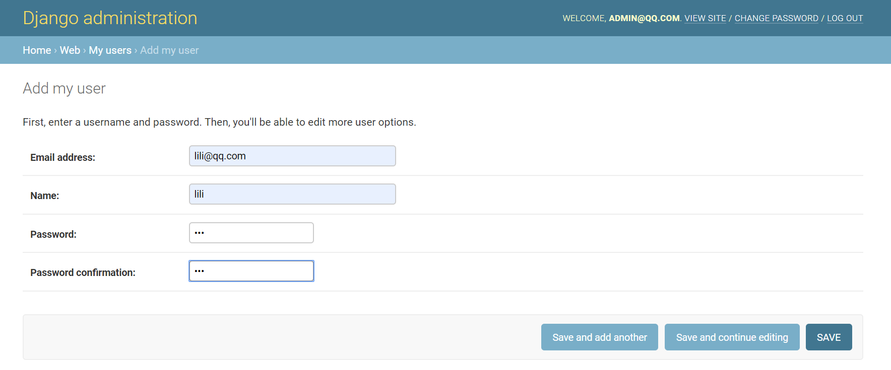
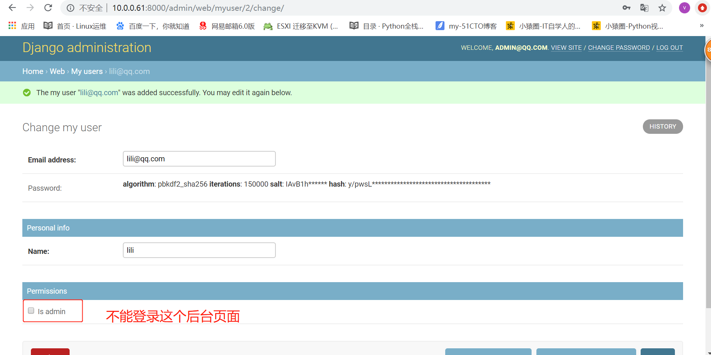
```
注意：
这里通过python manage.py createsuperuser 创建的是管理员账户，可以登录后台管理平台
其他新建的或自己注册的账户，默认是非管理员账户。
```
## 2.2restframwork
```
http://10.0.0.61:8000/api/
登录用户是上面注册的admin@qq.com/123
```

### 2.2.1发送post请求
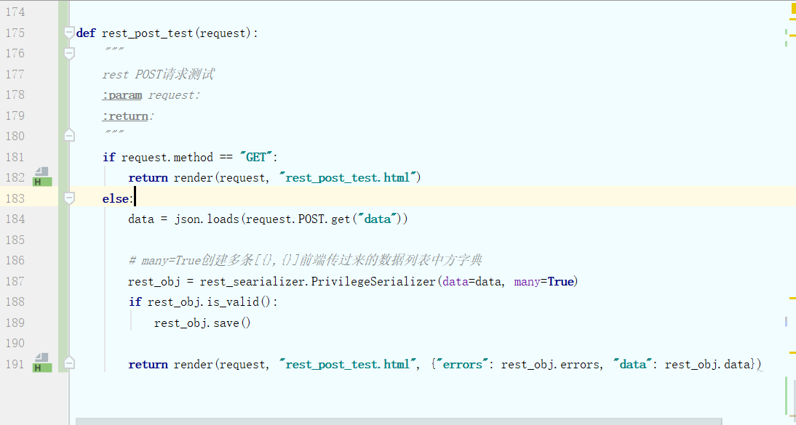


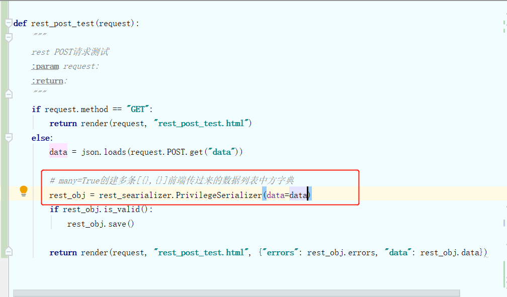


### 2.2.2关联表插入数据


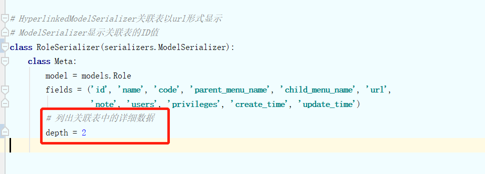

```
如果是
总结：
提交的数据形式与下面的形式相同
```
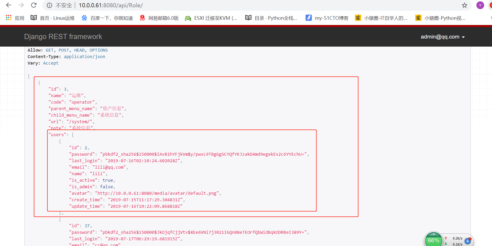
## 2.3角色权限
```
这里的角色权限是我自己设计的一种方式
对于左侧的菜单栏，通过给角色设置相应的parent_menu和child_munu和URL信息，
可以限制每个用户可以看到哪些菜单

至于页面中的按钮操作权限，是通过Privilege表控制的，角色与权限是多对多的关系
```
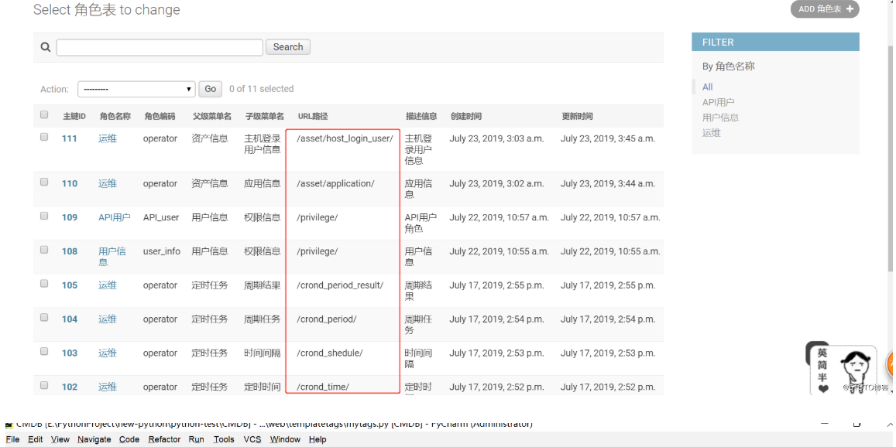
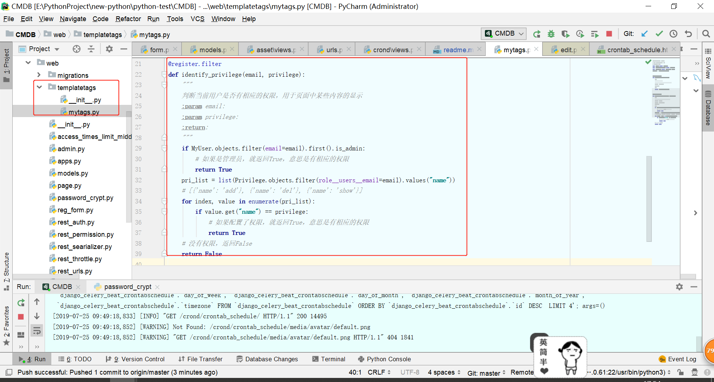
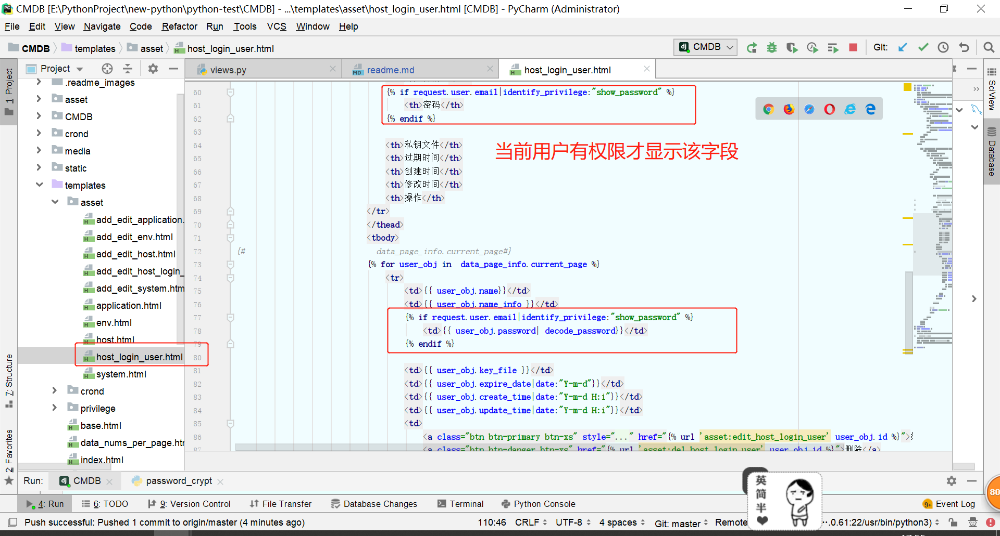
## 2.4前端中文，后端解码
```
前端
jquery
{#    $.cookie需要该js#}
    <script src="/static/js/jquery.cookie.js"></script>
    
不编码
$.cookie('role_search', '测试', { path: '/' });

后端
from urllib.parse import unquote
print(search_val)
print(unquote(search_val, "utf-8"))# 测试
print(unquote(unquote(search_val,"utf-8")))# 测试


前端
编码
$.cookie('role_search', encodeURIComponent('测试'), { path: '/' });
解码
$("#search").val(decodeURIComponent(role_search));

后端
from urllib.parse import unquote
print(search_val)#'%25E6%25B5%258B%25E8%25AF%2595'
print(unquote(search_val, "utf-8"))# %E6%B5%8B%E8%AF%95
print(unquote(unquote(search_val,"utf-8")))# 测试
```
## 2.5celery定时任务
### 2.5.1celery软件架构
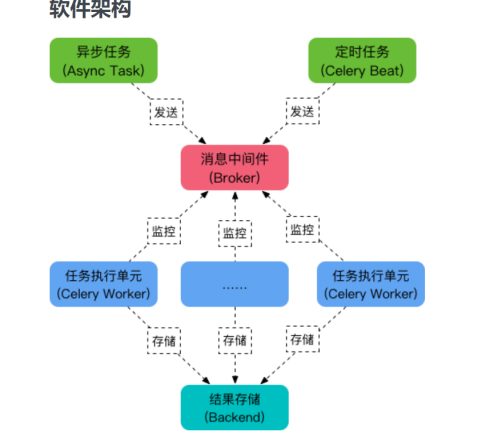
```
相关模块
# kombu版本
pip install kombu==4.2.0
# celery版本
pip install celery==4.1.1
版本不对，会报错
Django中解决redis-py versions 3.2.0 or later. You have 2.10.6版本问题
No module named 'kombu.matcher'

[root@m01 CMDB]# pip3 install celery
[root@m01 CMDB]# pip3 install django-celery-beat
[root@m01 CMDB]# pip3 install django-celery-results
```
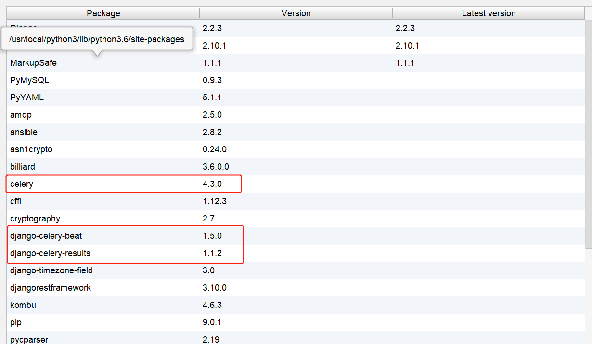
### 2.5.2celery模块介绍
```
任务模块 Task.py
包含异步任务和定时任务
异步任务：如果不想让程序等着结果返回，而是返回一个任务ID，过一段时间根据task_id获取任务的结果。
周期任务：根据设置的执行周期，定时周期性执行任务

消息中间件模块 Broker
app = Celery('tasks',backend='redis://10.0.0.61:6379/1',broker='redis://localhost:6379/0')
Broker，即为任务调度队列，接收任务生产者发来的消息（任务），将任务存入队列。
Celery本身不提供队列服务，官方推荐使用RabbitMQ和Redis等。

任务执行模块 Worker
[root@m01 CMDB]# celery -A CMDB worker -l info
#CMDB是Django项目名，或py文件的文件名
Worker是执行任务的处理单元，它实时监控消息队列，获取队列中的调度任务，并执行它。

任务结果存储模块 Backend
app = Celery('tasks',backend='redis://10.0.0.61:6379/1',broker='redis://localhost:6379/0')
Backend用于存储任务的执行结果，以供查询。
同消息中间件一样，存储也可以使用RabbitMQ或Redis或MongoDB等数据库

周期任务模块 Beat
[root@m01 CMDB]# celery -A CMDB beat
用于监控周期任务，把任务放到消息中间件broker中
worker监控到了broker中的任务，就会执行任务
```
### 2.5.3celery异步任务1-没有设置backend
```
1.进入到py文件所在目录
[root@m01 project]# pwd
/project

2.查看写好的异步程序
[root@m01 project]# cat sync.py 
#/usr/bin/python3
from celery import Celery,shared_task

app = Celery('tasks', broker='redis://10.0.0.61:6379/1')

@shared_task(name="add")
def add(x, y):
    return x + y
[root@m01 project]# 

3.手动把异步任务放到消息队列中
[root@m01 project]# python3
Python 3.6.3 (default, Jul 15 2019, 09:46:16) 
[GCC 4.4.7 20120313 (Red Hat 4.4.7-23)] on linux
Type "help", "copyright", "credits" or "license" for more information.
>>> from sync import add
>>> add.delay(2,3)   
<AsyncResult: 57ddfa56-8e80-448a-b912-243ce44fef70>

4.另打开一个xshell窗口，执行下面的命令，调用worker执行异步任务
[root@m01 project]# celery -A sync worker --loglevel=info
/usr/local/python3/lib/python3.6/site-packages/celery/platforms.py:801: RuntimeWarning: You're running the worker with superuser privileges: this is
absolutely not recommended!

Please specify a different user using the --uid option.

User information: uid=0 euid=0 gid=0 egid=0

  uid=uid, euid=euid, gid=gid, egid=egid,
 
 -------------- celery@m01 v4.3.0 (rhubarb)
---- **** ----- 
--- * ***  * -- Linux-2.6.32-696.el6.x86_64-x86_64-with-centos-6.9-Final 2019-07-18 14:45:06
-- * - **** --- 
- ** ---------- [config]
- ** ---------- .> app:         tasks:0x7f226e9250b8
- ** ---------- .> transport:   redis://10.0.0.61:6379/1
- ** ---------- .> results:     redis://10.0.0.61:6379/1
- *** --- * --- .> concurrency: 2 (prefork)
-- ******* ---- .> task events: OFF (enable -E to monitor tasks in this worker)
--- ***** ----- 
 -------------- [queues]
                .> celery           exchange=celery(direct) key=celery
                

[tasks]
  . add

[2019-07-18 14:45:07,042: INFO/MainProcess] Connected to redis://10.0.0.61:6379/1
[2019-07-18 14:45:07,050: INFO/MainProcess] mingle: searching for neighbors
[2019-07-18 14:45:08,082: INFO/MainProcess] mingle: all alone
[2019-07-18 14:45:08,091: INFO/MainProcess] celery@m01 ready.
[2019-07-18 14:45:29,634: INFO/MainProcess] Received task: add[74d07c57-b74d-4ded-9831-73ec4f739940]  
[2019-07-18 14:45:29,649: INFO/ForkPoolWorker-1] Task add[74d07c57-b74d-4ded-9831-73ec4f739940] 
succeeded in 0.012957275001099333s: 5     #返回结果


```
### 2.5.4celery异步任务2-设置backend
```
1.进入到py文件所在目录
[root@m01 project]# pwd
/project

2.程序代码
[root@m01 project]# cat sync2.py 
#/usr/bin/python3
from celery import Celery,shared_task

app = Celery('tasks', backend='redis://10.0.0.61:6379/1',broker='redis://10.0.0.61:6379/1')

@shared_task(name="add")
def add(x, y):
    return x + y
[root@m01 project]# 

3.没有启动worker时，调用异步任务
[root@m01 project]# python3
Python 3.6.3 (default, Jul 15 2019, 09:46:16) 
[GCC 4.4.7 20120313 (Red Hat 4.4.7-23)] on linux
Type "help", "copyright", "credits" or "license" for more information.
>>> from sync2 import add
>>> add.delay(2,3)   
<AsyncResult: 57ddfa56-8e80-448a-b912-243ce44fef70> # 任务ID
>>> re=add.delay(2,3)    
>>> re.ready() # 只有设置了backend才能调用ready()。orker没有启动，任务没有执行时，返回值为False
False
>>> re.get(timeout=1)  #worker没有启动，任务没有执行时，超时时间过了会报错
Traceback (most recent call last):
  File "/usr/local/python3/lib/python3.6/site-packages/celery/backends/asynchronous.py", line 255, in _wait_for_pending
    on_interval=on_interval):
  File "/usr/local/python3/lib/python3.6/site-packages/celery/backends/asynchronous.py", line 54, in drain_events_until
    raise socket.timeout()
socket.timeout

During handling of the above exception, another exception occurred:

Traceback (most recent call last):
  File "<stdin>", line 1, in <module>
  File "/usr/local/python3/lib/python3.6/site-packages/celery/result.py", line 226, in get
    on_message=on_message,
  File "/usr/local/python3/lib/python3.6/site-packages/celery/backends/asynchronous.py", line 188, in wait_for_pending
    for _ in self._wait_for_pending(result, **kwargs):
  File "/usr/local/python3/lib/python3.6/site-packages/celery/backends/asynchronous.py", line 259, in _wait_for_pending
    raise TimeoutError('The operation timed out.')
celery.exceptions.TimeoutError: The operation timed out.
>>> re.get() #没有启动worker，会阻塞在这里，等待结果

4.启动worker
[root@m01 project]# celery -A sync2 worker --loglevel=info
/usr/local/python3/lib/python3.6/site-packages/celery/platforms.py:801: RuntimeWarning: You're running the worker with superuser privileges: this is
absolutely not recommended!

Please specify a different user using the --uid option.

User information: uid=0 euid=0 gid=0 egid=0

  uid=uid, euid=euid, gid=gid, egid=egid,
 
 -------------- celery@m01 v4.3.0 (rhubarb)
---- **** ----- 
--- * ***  * -- Linux-2.6.32-696.el6.x86_64-x86_64-with-centos-6.9-Final 2019-07-18 14:45:06
-- * - **** --- 
- ** ---------- [config]
- ** ---------- .> app:         tasks:0x7f226e9250b8
- ** ---------- .> transport:   redis://10.0.0.61:6379/1
- ** ---------- .> results:     redis://10.0.0.61:6379/1
- *** --- * --- .> concurrency: 2 (prefork)
-- ******* ---- .> task events: OFF (enable -E to monitor tasks in this worker)
--- ***** ----- 
 -------------- [queues]
                .> celery           exchange=celery(direct) key=celery
                

[tasks]
  . add

[2019-07-18 14:45:07,042: INFO/MainProcess] Connected to redis://10.0.0.61:6379/1
[2019-07-18 14:45:07,050: INFO/MainProcess] mingle: searching for neighbors
[2019-07-18 14:45:08,082: INFO/MainProcess] mingle: all alone
[2019-07-18 14:45:08,091: INFO/MainProcess] celery@m01 ready.
[2019-07-18 14:45:29,634: INFO/MainProcess] Received task: add[74d07c57-b74d-4ded-9831-73ec4f739940]  
[2019-07-18 14:45:29,649: INFO/ForkPoolWorker-1] Task add[74d07c57-b74d-4ded-9831-73ec4f739940] 
succeeded in 0.012957275001099333s: 5

5.调用处可以查看到结果
>>> re.get()
5
>>> re.get(propagate=False)
5

6.异步任务根据task_id获取任务结果，只有设置了backend才能调用
>>> add.delay(1,2)  
<AsyncResult: 57ddfa56-8e80-448a-b912-243ce44fef70>
>>> from celery.result import AsyncResult

>>> res=AsyncResult("57ddfa56-8e80-448a-b912-243ce44fef70")
>>> re.result
3

7.redis中查看结果
```

### 2.5.5celery周期任务
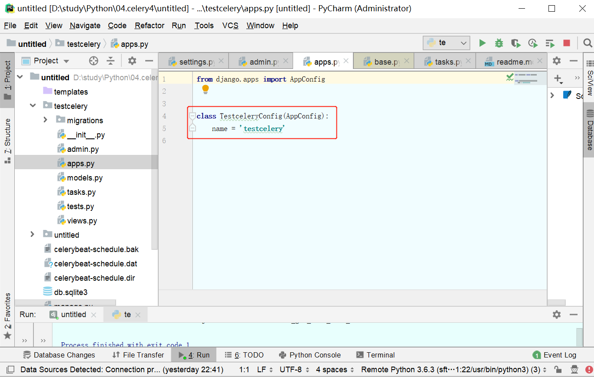

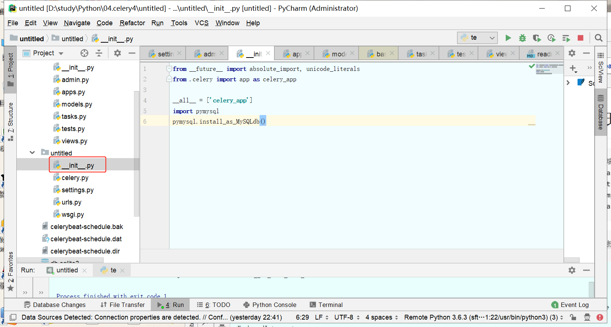
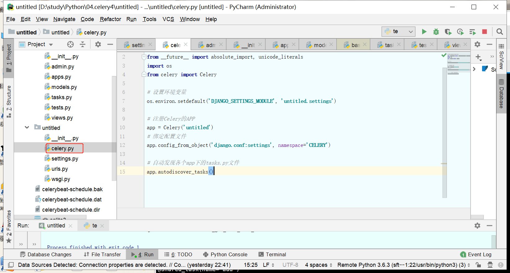
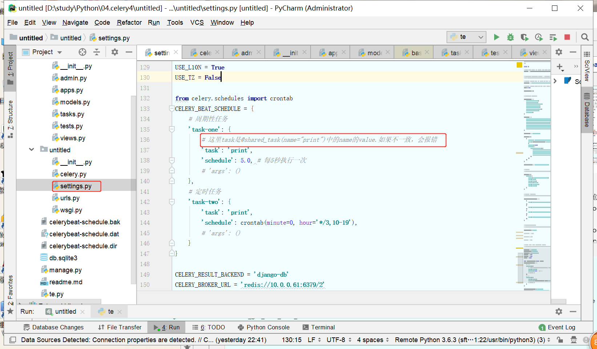
```
1.创建result表
[root@m01 project]# cd /tmp/untitled/
[root@m01 untitled]# ll
total 60
-rw-r--r-- 1 root root    89 Jul 18 13:13 celerybeat-schedule.bak
-rw-r--r-- 1 root root  8731 Jul 18 13:13 celerybeat-schedule.dat
-rw-r--r-- 1 root root    89 Jul 18 13:13 celerybeat-schedule.dir
-rw-r--r-- 1 root root 18432 Jul 16  2018 db.sqlite3
-rw-r--r-- 1 root root   540 Jul 16  2018 manage.py
-rw-r--r-- 1 root root  2862 Jul 18 15:54 readme.md
-rw-r--r-- 1 root root   188 Jul 18 14:46 te.py
drwxr-xr-x 4 root root  4096 Jul 18 13:05 testcelery
drwxr-xr-x 3 root root  4096 Jul 18 13:02 untitled
# 创建result表
[root@m01 untitled]# python3 manage.py migrate

2.启动worker
[root@m01 untitled]# celery -A untitled worker -l info
/usr/local/python3/lib/python3.6/site-packages/celery/platforms.py:801: RuntimeWarning: You're running the worker with superuser privileges: this is
absolutely not recommended!

Please specify a different user using the --uid option.

User information: uid=0 euid=0 gid=0 egid=0

  uid=uid, euid=euid, gid=gid, egid=egid,
 
 -------------- celery@m01 v4.3.0 (rhubarb)
---- **** ----- 
--- * ***  * -- Linux-2.6.32-696.el6.x86_64-x86_64-with-centos-6.9-Final 2019-07-18 13:13:52
-- * - **** --- 
- ** ---------- [config]
- ** ---------- .> app:         untitled:0x7fa14a5312e8
- ** ---------- .> transport:   redis://10.0.0.61:6379/2
- ** ---------- .> results:     
- *** --- * --- .> concurrency: 2 (prefork)
-- ******* ---- .> task events: OFF (enable -E to monitor tasks in this worker)
--- ***** ----- 
 -------------- [queues]
                .> celery           exchange=celery(direct) key=celery
                

[tasks]
  . printqw

[2019-07-18 13:13:52,288: INFO/MainProcess] Connected to redis://10.0.0.61:6379/2
[2019-07-18 13:13:52,297: INFO/MainProcess] mingle: searching for neighbors
[2019-07-18 13:13:53,319: INFO/MainProcess] mingle: all alone
[2019-07-18 13:13:53,330: WARNING/MainProcess] /usr/local/python3/lib/python3.6/site-packages/celery/fixups/django.py:202: UserWarning: Using settings.DEBUG leads to a memory leak, never use this setting in production environments!
  warnings.warn('Using settings.DEBUG leads to a memory leak, never '
[2019-07-18 13:13:53,331: INFO/MainProcess] celery@m01 ready.
[2019-07-18 13:13:53,448: INFO/MainProcess] Received task: printqw[e3d1792f-7628-4861-9fc7-05fd8e7ce537]  
[2019-07-18 13:13:53,469: INFO/ForkPoolWorker-1] Task printqw[e3d1792f-7628-4861-9fc7-05fd8e7ce537] succeeded in 0.01883281399932457s: 'hello celery and django...'
[2019-07-18 13:13:53,969: INFO/MainProcess] Received task: printqw[b874cb79-4aac-4b09-a9f8-5906bf09326b]  
[2019-07-18 13:13:53,979: INFO/ForkPoolWorker-1] Task printqw[b874cb79-4aac-4b09-a9f8-5906bf09326b] succeeded in 0.009641711996664526s: 'hello celery and django...'

3.启动beat,周期性把任务放到队列中
[root@m01 untitled]# celery -A untitled beat -l info
celery beat v4.3.0 (rhubarb) is starting.
__    -    ... __   -        _
LocalTime -> 2019-07-18 13:13:48
Configuration ->
    . broker -> redis://10.0.0.61:6379/2
    . loader -> celery.loaders.app.AppLoader
    . scheduler -> celery.beat.PersistentScheduler
    . db -> celerybeat-schedule
    . logfile -> [stderr]@%INFO
    . maxinterval -> 5.00 minutes (300s)
[2019-07-18 13:13:48,957: INFO/MainProcess] beat: Starting...
[2019-07-18 13:13:48,978: INFO/MainProcess] Scheduler: Sending due task task-one (printqw)
[2019-07-18 13:13:53,967: INFO/MainProcess] Scheduler: Sending due task task-one (printqw)

4.任务结果
```


### 2.5.7celery周期任务之admin配置
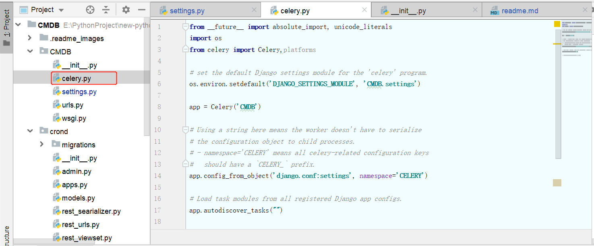
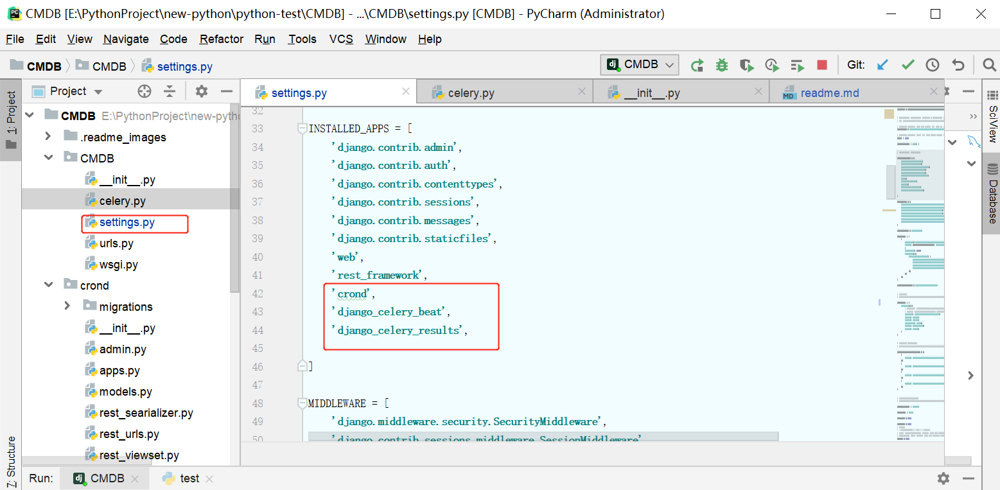

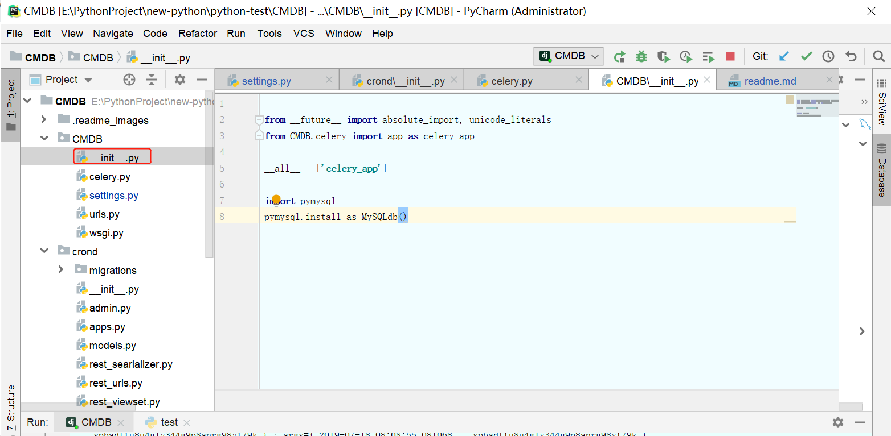
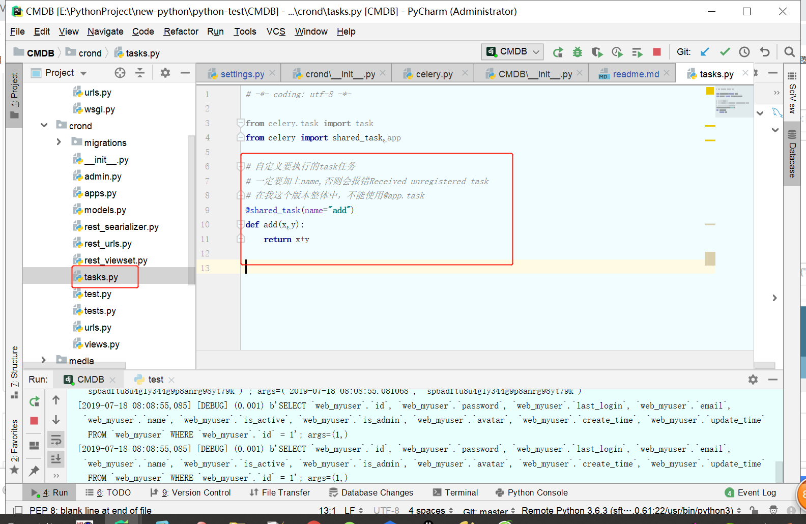
```
task有修改，需要重启
[root@m01 CMDB]# celery -A CMDB worker --loglevel=info >/project/celery_work.log 2>&1 &
[1] 7071
在celery调用ansible的时候，不管是定时任务还是一部任务，都得不到返回结果
搜索之后，发现说是celery3.1以上的版本，不支持另起子线程，
有两种方法解决这个问题，就是关闭assert：
1.在celery 的worker启动窗口设置export PYTHONOPTIMIZE=1或打开celery这个参数-O OPTIMIZATION
2.注释掉python包multiprocessing下面process.py中102行，关闭assert

 export PYTHONOPTIMIZE=1 && celery -A CMDB worker --loglevel=info
[root@m01 CMDB]# celery -A CMDB beat --loglevel=info >/project/celery_beat.log 2>&1 &
[2] 7077

```


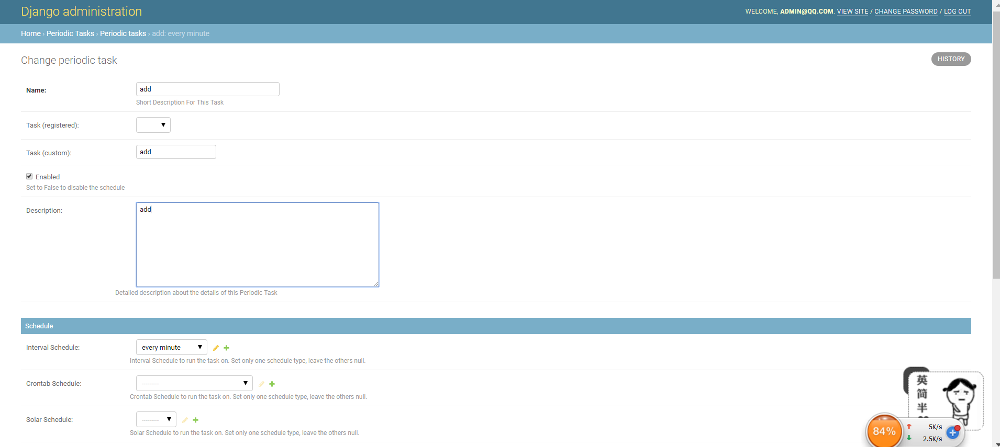

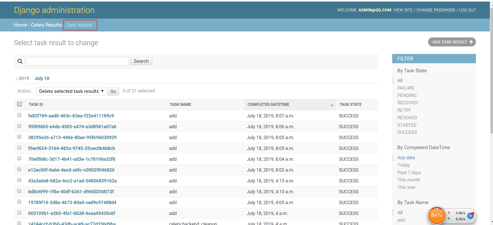
```

# 创建表结构
[root@m01 CMDB]# python3 manage.py migrate

[root@m01 CMDB]# pwd
/project/CMDB
# 启动worker，监听队列中的任务，执行任务
[root@m01 CMDB]# celery -A CMDB worker -l info
# 周期性的吧任务放到队列中
[root@m01 CMDB]# celery -A CMDB beat
注意：
这里的celery命令，是pip install celery后生成的，默认放在了python安装路径下/usr/local/python3/bin/celery 
需要手动建立连接：ln -s /usr/local/python3/bin/celery  /usr/bin/celery 这样就可以直接使用了
```
## 2.6webssh
```
后端一定记得启动webssh
[root@m01 CMDB]# python3    webssh/main.py

webssh 终端ssh登录 参考的 https://github.com/huashengdun/webssh 此项目

```
## 2.7ansible
```
更多相关API看我写在test*.py中的输出，
pip3 install ansible==2.7.12
注意：2.8的版本已經沒有Options了，可以參考
https://lex-lee.blog.csdn.net/article/details/92837916
我這裡就使用了2.7.的版本，最新版本稍后研究
```

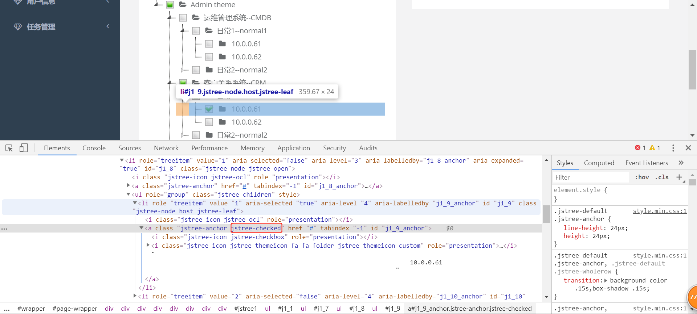
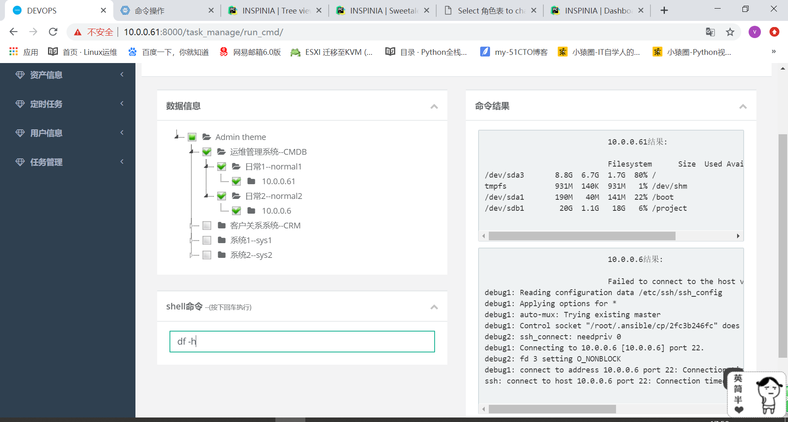


