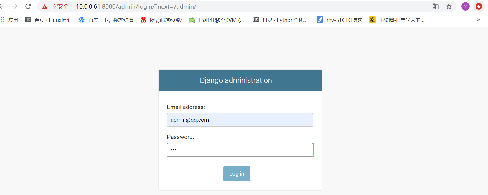
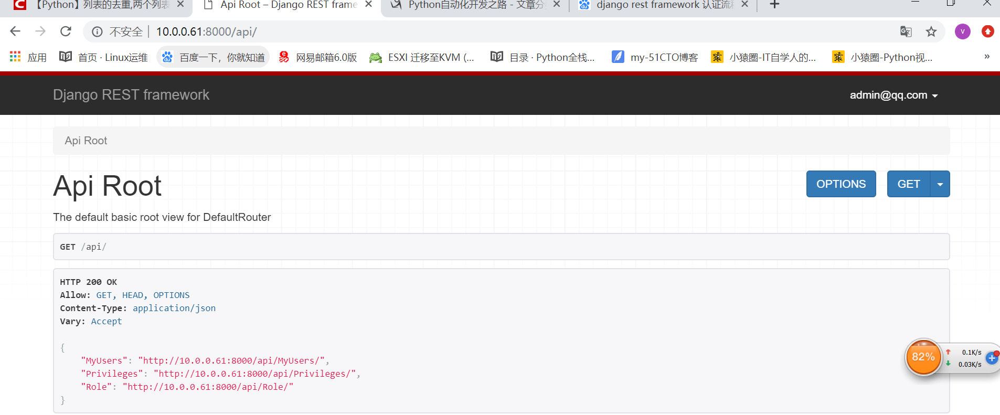

# 1.环境准备
```
前端：购买的INSPINIA完整版
django==2.2.3
python==3.6.3
pymysql==0.9.3
djangorestframework==3.10.0
```
```
1.把本地代码上传到linux上
https://blog.51cto.com/10983441/2380368
最后一条1.11配置，本地代码上传到linux上

2.linux系统
python安装
cd /opt
wget https://www.python.org/ftp/python/3.6.3/Python-3.6.3.tar.xz
tar xf Python-3.6.3.tar.xz
cd /opt/Python-3.6.3/
./configure
yum install gcc-c++ gcc -y  #安装编译所需依赖
make  && make install

3.配置环境变量
cat /etc/profile
export PATH=$PATH:/usr/local/python3/bin/
生效
source /etc/profile

接下来就可以验证
[root@m01 opt]# python3
Python 3.6.3 (default, Jul 15 2019, 09:46:16) 
[GCC 4.4.7 20120313 (Red Hat 4.4.7-23)] on linux
Type "help", "copyright", "credits" or "license" for more information.
>>> 
[root@m01 opt]# pip3

Usage:   
  pip <command> [options]
  
  
4.连接mysql报错信息处理方法
 raise ImproperlyConfigured('mysqlclient 1.3.13 or newer is required; you have %s.' % Database.__version__)
django.core.exceptions.ImproperlyConfigured: mysqlclient 1.3.13 or newer is required; you have 0.9.3.
解决方法
注释掉下面内容
#if version < (1, 3, 13):
#    raise ImproperlyConfigured('mysqlclient 1.3.13 or newer is required; you have %s.' % Database.__version__)


File "/usr/local/python3/lib/python3.6/site-packages/django/db/backends/mysql/operations.py", line 146, in last_executed_query
    query = query.decode(errors='replace')
AttributeError: 'str' object has no attribute 'decode'
解决方法：
把decode改为encode()
query = query.encode(errors='replace')

5.生成数据，在Linux上操作，windows上操作会报错
[root@m01 CMDB]# pwd
/project/CMDB
[root@m01 CMDB]# python3 manage.py makemigrations
[root@m01 CMDB]# python3 manage.py migrate

```

# 2.功能解析
## 2.1自定义用户认证
```
参考https://docs.djangoproject.com/zh-hans/2.1/topics/auth/customizing/
由于我后来为用户添加了头像字段，所以稍有更改，可以查看项目代码

models.py
from django.db import models

# Create your models here.
from django.db import models
from django.contrib.auth.models import (
    BaseUserManager, AbstractBaseUser
)


class MyUserManager(BaseUserManager):
    def create_user(self, email, name, password=None):
        """
        Creates and saves a User with the given email, date of
        birth and password.
        """
        if not email:
            raise ValueError('Users must have an email address')

        user = self.model(
            email=self.normalize_email(email),
            name=name,
        )

        user.set_password(password)
        user.save(using=self._db)
        return user

    def create_superuser(self, email, name, password):
        """
        Creates and saves a superuser with the given email, date of
        birth and password.
        """
        user = self.create_user(
            email,
            password=password,
            name=name,
        )
        user.is_admin = True
        user.save(using=self._db)
        return user


class MyUser(AbstractBaseUser):
    email = models.EmailField(
        verbose_name='email address',
        max_length=255,
        unique=True,
    )
    name = models.CharField(max_length=32)
    is_active = models.BooleanField(default=True)
    is_admin = models.BooleanField(default=False)

    objects = MyUserManager()

    USERNAME_FIELD = 'email'
    REQUIRED_FIELDS = ['name']

    def __str__(self):
        return self.email

    def has_perm(self, perm, obj=None):
        "Does the user have a specific permission?"
        # Simplest possible answer: Yes, always
        return True

    def has_module_perms(self, app_label):
        "Does the user have permissions to view the app `app_label`?"
        # Simplest possible answer: Yes, always
        return True

    @property
    def is_staff(self):
        "Is the user a member of staff?"
        # Simplest possible answer: All admins are staff
        return self.is_admin
```
```
 admin.py
 from django.contrib import admin

# Register your models here.
from django import forms
from django.contrib import admin
from django.contrib.auth.models import Group
from django.contrib.auth.admin import UserAdmin as BaseUserAdmin
from django.contrib.auth.forms import ReadOnlyPasswordHashField

from web.models import MyUser


class UserCreationForm(forms.ModelForm):
    """A form for creating new users. Includes all the required
    fields, plus a repeated password."""
    password1 = forms.CharField(label='Password', widget=forms.PasswordInput)
    password2 = forms.CharField(label='Password confirmation', widget=forms.PasswordInput)

    class Meta:
        model = MyUser
        fields = ('email', 'name')

    def clean_password2(self):
        # Check that the two password entries match
        password1 = self.cleaned_data.get("password1")
        password2 = self.cleaned_data.get("password2")
        if password1 and password2 and password1 != password2:
            raise forms.ValidationError("Passwords don't match")
        return password2

    def save(self, commit=True):
        # Save the provided password in hashed format
        user = super().save(commit=False)
        user.set_password(self.cleaned_data["password1"])
        if commit:
            user.save()
        return user


class UserChangeForm(forms.ModelForm):
    """A form for updating users. Includes all the fields on
    the user, but replaces the password field with admin's
    password hash display field.
    """
    password = ReadOnlyPasswordHashField()

    class Meta:
        model = MyUser
        fields = ('email', 'password', 'name', 'is_active', 'is_admin')

    def clean_password(self):
        # Regardless of what the user provides, return the initial value.
        # This is done here, rather than on the field, because the
        # field does not have access to the initial value
        return self.initial["password"]


class UserAdmin(BaseUserAdmin):
    # The forms to add and change user instances
    form = UserChangeForm
    add_form = UserCreationForm

    # The fields to be used in displaying the User model.
    # These override the definitions on the base UserAdmin
    # that reference specific fields on auth.User.
    list_display = ('email', 'name', 'is_admin')
    list_filter = ('is_admin',)
    fieldsets = (
        (None, {'fields': ('email', 'password')}),
        ('Personal info', {'fields': ('name',)}),
        ('Permissions', {'fields': ('is_admin',)}),
    )
    # add_fieldsets is not a standard ModelAdmin attribute. UserAdmin
    # overrides get_fieldsets to use this attribute when creating a user.
    # 创建用户时，列出的需要添加的字段信息
    add_fieldsets = (
        (None, {
            'classes': ('wide',),
            'fields': ('email', 'name', 'password1', 'password2')}
        ),
    )
    # 搜索字段
    search_fields = ('email',)
    # 排序字段
    ordering = ('email',)
    filter_horizontal = ()


# Now register the new UserAdmin...
admin.site.register(MyUser, UserAdmin)
# ... and, since we're not using Django's built-in permissions,
# unregister the Group model from admin.
admin.site.unregister(Group)
```
```
settings.py
# 由于自己重写了user表，所以需要在这里添加一条配置
AUTH_USER_MODEL = 'web.MyUser'
```
```
效果
[root@m01 CMDB]# python3 manage.py createsuperuser
(0.000) b'SELECT @@SQL_AUTO_IS_NULL'; args=None
(0.000) b'SET SESSION TRANSACTION ISOLATION LEVEL READ COMMITTED'; args=None
(0.001) b'SHOW FULL TABLES'; args=None
(0.001) b'SELECT `django_migrations`.`app`, `django_migrations`.`name` FROM `django_migrations`'; args=()
#输入邮箱
Email address: admin@qq.com

(0.001) b"SELECT `web_myuser`.`id`, `web_myuser`.`password`, `web_myuser`.`last_login`, `web_myuser`.`email`, `web_myuser`.`name`, `web_myuser`.`is_active`, `web_myuser`.`is_admin` FROM `web_myuser` WHERE `web_myuser`.`email` = 'admin@qq.com'"; args=('admin@qq.com',)
#输入用户名和密码
Name: admin
Password: 
Password (again): 

This password is too short. It must contain at least 8 characters.
This password is too common.
This password is entirely numeric.
Bypass password validation and create user anyway? [y/N]: y

(0.006) b"INSERT INTO `web_myuser` (`password`, `last_login`, `email`, `name`, `is_active`, `is_admin`) VALUES ('pbkdf2_sha256$150000$UTuxK141CULH$MNQ4TR8iwU7pVl8pEX03eb9KmEASze+4CoNK8d1PaCc=', NULL, 'admin@qq.com', 'admin', 1, 0)"; args=['pbkdf2_sha256$150000$UTuxK141CULH$MNQ4TR8iwU7pVl8pEX03eb9KmEASze+4CoNK8d1PaCc=', None, 'admin@qq.com', 'admin', True, False]
(0.003) b"UPDATE `web_myuser` SET `password` = 'pbkdf2_sha256$150000$UTuxK141CULH$MNQ4TR8iwU7pVl8pEX03eb9KmEASze+4CoNK8d1PaCc=', `last_login` = NULL, `email` = 'admin@qq.com', `name` = 'admin', `is_active` = 1, `is_admin` = 1 WHERE `web_myuser`.`id` = 1"; args=('pbkdf2_sha256$150000$UTuxK141CULH$MNQ4TR8iwU7pVl8pEX03eb9KmEASze+4CoNK8d1PaCc=', 'admin@qq.com', 'admin', True, True, 1)
Superuser created successfully.

```



```
注意：
这里通过python manage.py createsuperuser 创建的是管理员账户，可以登录后台管理平台
其他新建的或自己注册的账户，默认是非管理员账户。
```
## 2.2restframwork
```
http://10.0.0.61:8000/api/
登录用户是上面注册的admin@qq.com/123
```

## 2.3角色权限
```
这里的角色权限是我自己设计的一种方式
对于左侧的菜单栏，通过给角色设置相应的parent_menu和child_munu和URL信息，
可以限制每个用户可以看到哪些菜单

至于页面中的按钮操作权限，是通过Privilege表控制的，角色与权限是多对多的关系
```