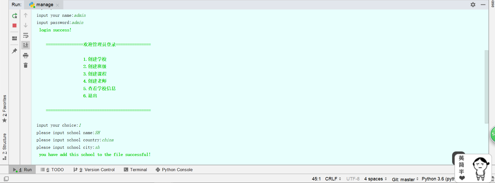
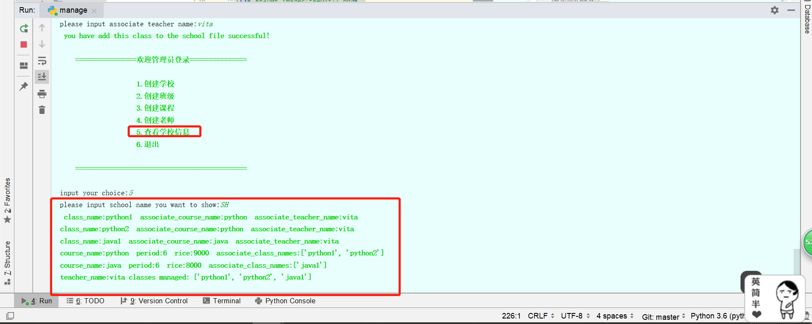
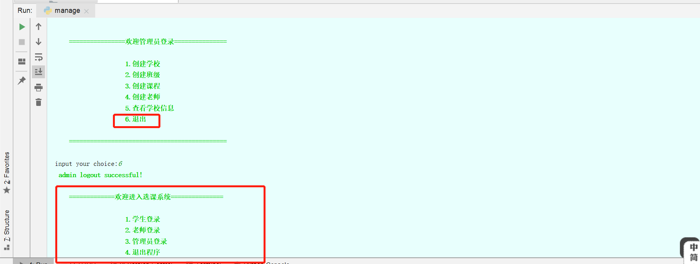
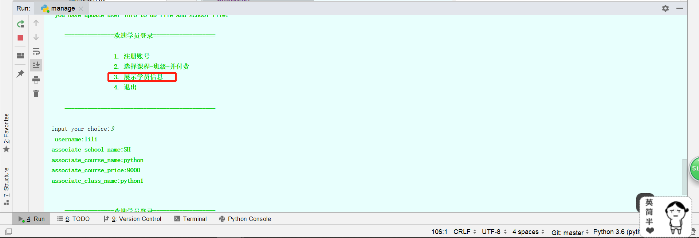
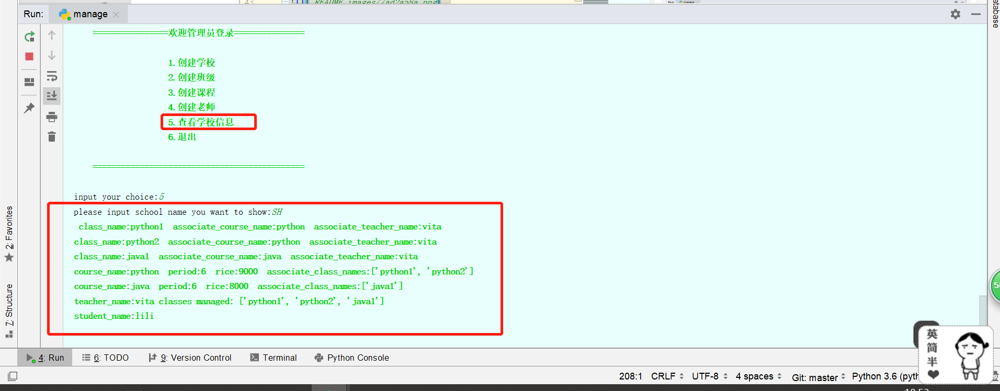
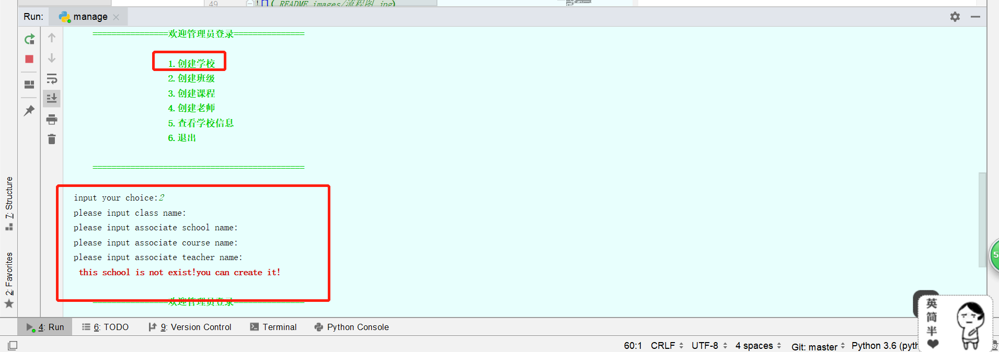
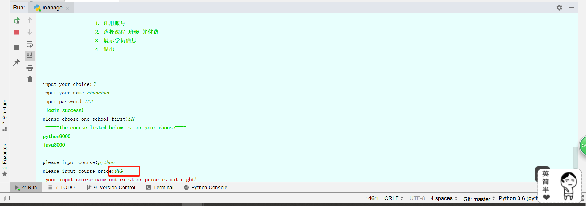
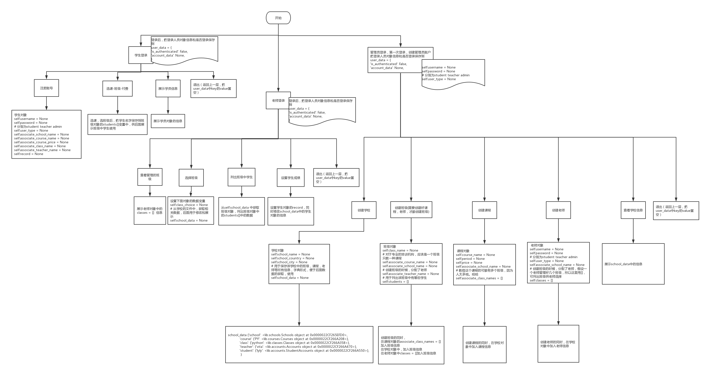

# 1.程序的实现功能
```
基础需求：
角色:学校、学员、课程、讲师
要求:
1. 创建北京、上海 2 所学校
2. 创建linux , python , go 3个课程 ， linux\py 在北京开， go 在上海开
3. 课程包含，周期，价格，通过学校创建课程 
4. 通过学校创建班级， 班级关联课程、讲师
5. 创建学员时，选择学校，关联班级
5. 创建讲师角色时要关联学校
6. 提供三个角色接口
    6.1 学员视图， 可以注册， 交学费， 选择班级
    6.2 讲师视图， 讲师可管理自己的班级， 上课时选择班级， 查看班级学员列表 ， 修改所管理的学员的成绩
    6.3 管理视图，创建讲师， 创建班级，创建课程
7. 上面的操作产生的数据都通过pickle序列化保存到文件里
```
# 2.程序的启动方式
```
python版本3.6.2
```

# 3.程序的登录信息
```
管理员账号密码[admin|admin]
普通账户的信息在db/accounts/student和teacher下，密码我设置的都是123
程序运行结果的"测试后，查看学校信息"可查看到当前的课程，班级，学生信息
```
# 4.程序的运行效果




创建的班级，课程信息






错误演示





测试后，查看学校信息


# 5.程序流程图

